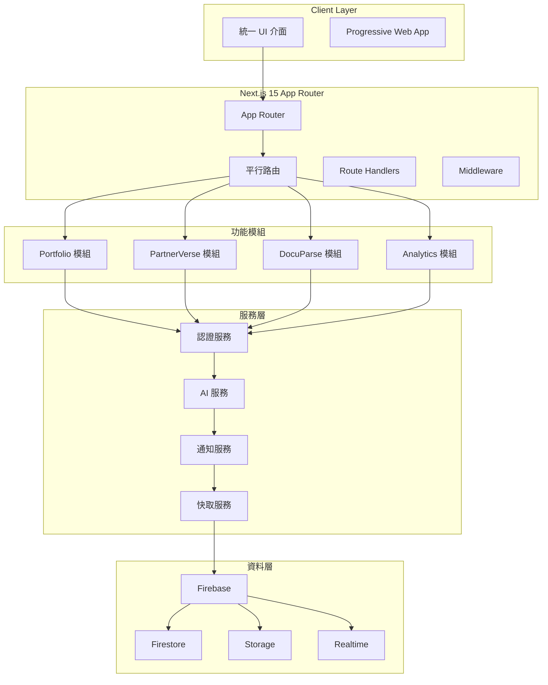
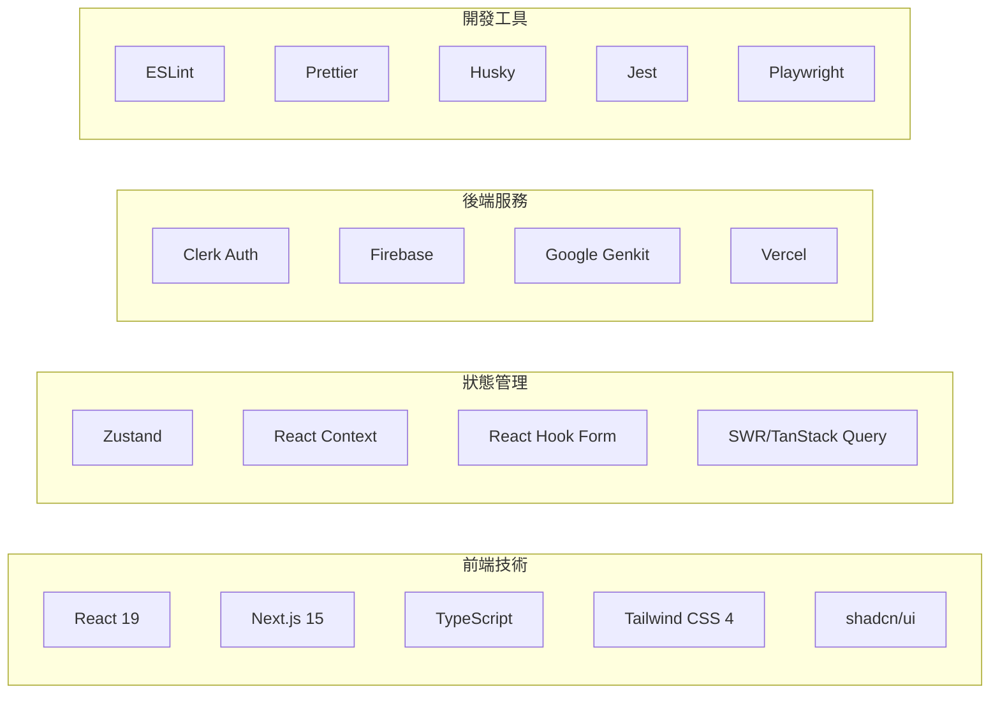
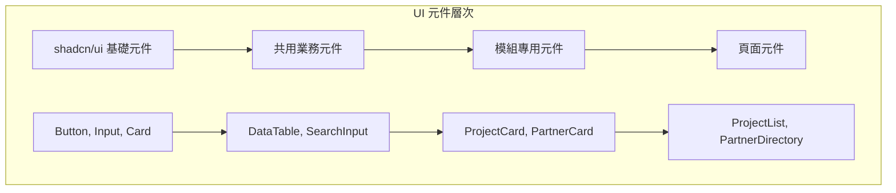
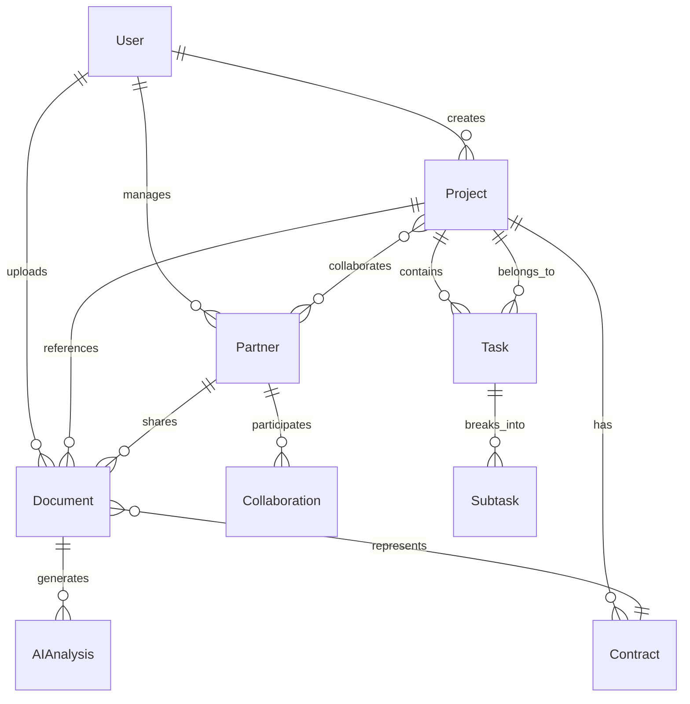
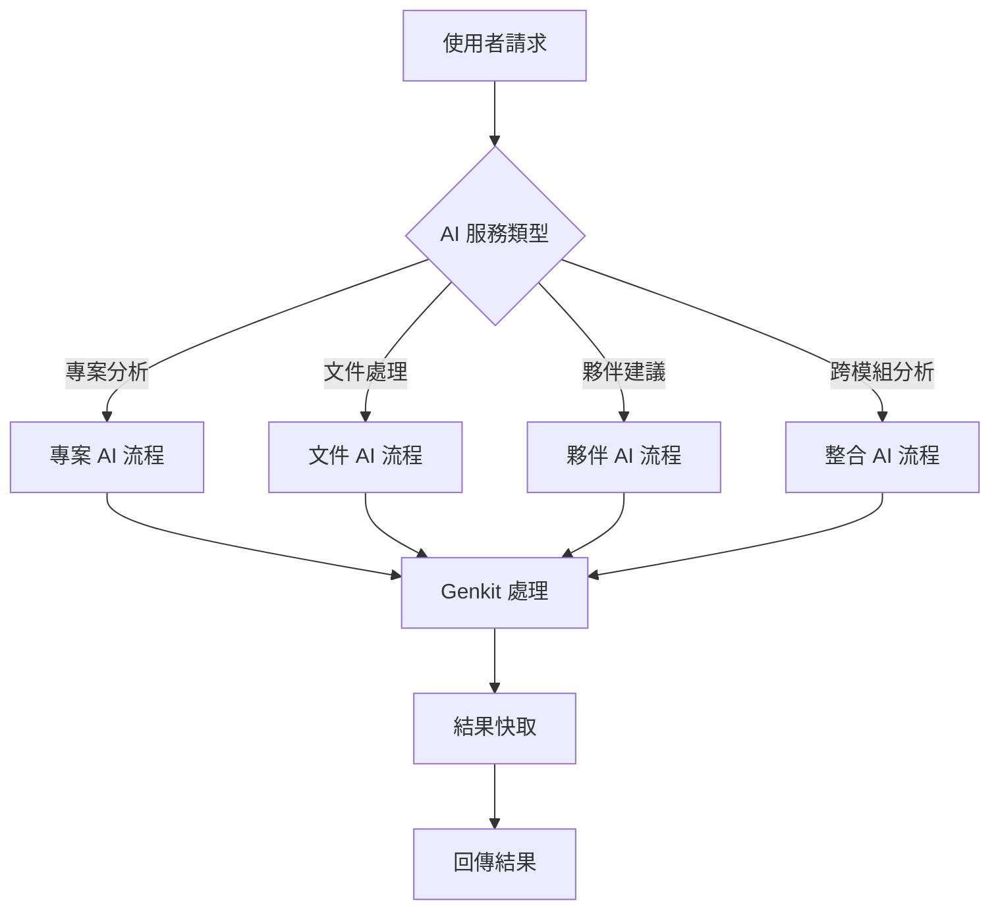
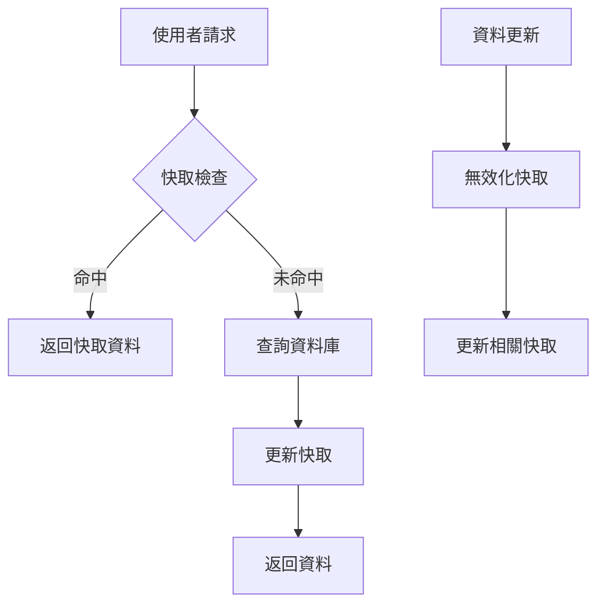
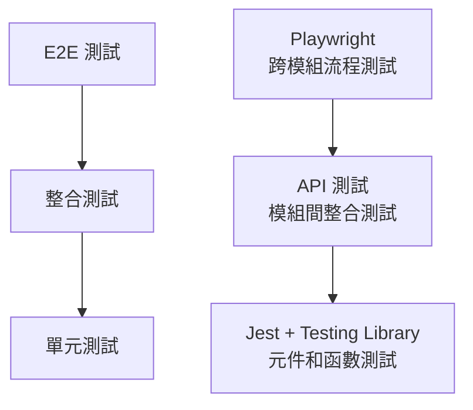

# 專案整合設計文件

## 概述

本設計文件詳細說明如何將四個獨立的 Next.js 專案整合成一個統一的現代化平台。設計採用 Next.js 15 App Router 的平行路由架構，確保各模組既能獨立運作又能緊密整合。

## 系統架構

### 整體架構圖



### 技術棧架構



## 平行路由設計

### 路由結構

```
app/
├── (auth)/                     # 認證路由群組
│   ├── layout.tsx
│   ├── sign-in/[[...sign-in]]/
│   └── sign-up/[[...sign-up]]/
├── (dashboard)/                # 主要應用路由群組
│   ├── @portfolio/             # Portfolio 平行路由槽
│   ├── @partners/              # PartnerVerse 平行路由槽
│   ├── @documents/             # DocuParse 平行路由槽
│   ├── @analytics/             # Analytics 平行路由槽
│   ├── layout.tsx              # 統一佈局
│   └── page.tsx                # 儀表板首頁
└── api/                        # Route Handlers
```

### 平行路由實作

```typescript
// app/(dashboard)/layout.tsx
interface DashboardLayoutProps {
  children: React.ReactNode
  portfolio: React.ReactNode
  partners: React.ReactNode
  documents: React.ReactNode
  analytics: React.ReactNode
}

export default function DashboardLayout({
  children,
  portfolio,
  partners,
  documents,
  analytics
}: DashboardLayoutProps) {
  const { user, permissions } = useAuth()
  const { activeModules } = useModuleVisibility(permissions)
  
  return (
    <div className="dashboard-layout">
      <AppSidebar />
      <main className="main-content">
        <Header />
        <div className="content-area">
          {children}
          <div className="modules-grid">
            {activeModules.portfolio && (
              <Suspense fallback={<ModuleSkeleton />}>
                {portfolio}
              </Suspense>
            )}
            {activeModules.partners && (
              <Suspense fallback={<ModuleSkeleton />}>
                {partners}
              </Suspense>
            )}
            {activeModules.documents && (
              <Suspense fallback={<ModuleSkeleton />}>
                {documents}
              </Suspense>
            )}
            {activeModules.analytics && (
              <Suspense fallback={<ModuleSkeleton />}>
                {analytics}
              </Suspense>
            )}
          </div>
        </div>
      </main>
    </div>
  )
}
```

## 元件架構設計

### UI 元件層次結構



### 元件設計原則

```typescript
// 基礎元件範例
interface BaseComponentProps {
  className?: string
  children?: React.ReactNode
  variant?: 'default' | 'secondary' | 'destructive'
  size?: 'sm' | 'md' | 'lg'
}

// 業務元件範例
interface BusinessComponentProps extends BaseComponentProps {
  data: DataType
  onAction?: (action: ActionType) => void
  loading?: boolean
  error?: Error | null
}

// 模組元件範例
interface ModuleComponentProps extends BusinessComponentProps {
  moduleConfig: ModuleConfig
  permissions: UserPermissions
}
```

## 資料架構設計

### 統一資料模型

```typescript
// 核心實體定義
interface BaseEntity {
  id: string
  createdAt: Timestamp
  updatedAt: Timestamp
  createdBy: string
  updatedBy: string
}

interface User extends BaseEntity {
  email: string
  name: string
  avatar?: string
  role: UserRole
  permissions: Permission[]
  preferences: UserPreferences
}

interface Project extends BaseEntity {
  title: string
  description: string
  status: ProjectStatus
  priority: Priority
  startDate: Date
  endDate?: Date
  progress: number
  tags: string[]
  // 關聯資料
  partnerId?: string
  documentIds: string[]
  taskIds: string[]
  contractIds: string[]
}

interface Partner extends BaseEntity {
  name: string
  type: PartnerType
  contactInfo: ContactInfo
  relationship: RelationshipType
  status: PartnerStatus
  // 關聯資料
  projectIds: string[]
  documentIds: string[]
  collaborationIds: string[]
}

interface Document extends BaseEntity {
  filename: string
  originalName: string
  mimeType: string
  size: number
  url: string
  // AI 處理結果
  extractedText?: string
  summary?: string
  keywords: string[]
  entities: ExtractedEntity[]
  // 關聯資料
  projectId?: string
  partnerId?: string
  contractId?: string
}
```

### 資料關係圖



## 認證與授權設計

### Clerk 整合架構

```typescript
// 認證配置
const clerkConfig = {
  publishableKey: process.env.NEXT_PUBLIC_CLERK_PUBLISHABLE_KEY,
  secretKey: process.env.CLERK_SECRET_KEY,
  signInUrl: '/sign-in',
  signUpUrl: '/sign-up',
  afterSignInUrl: '/dashboard',
  afterSignUpUrl: '/onboarding'
}

// 權限系統設計
interface Permission {
  resource: string // 'projects', 'partners', 'documents'
  action: string   // 'create', 'read', 'update', 'delete'
  scope: string    // 'own', 'team', 'all'
}

interface Role {
  name: string
  permissions: Permission[]
}

// 預定義角色
const roles: Record<string, Role> = {
  admin: {
    name: 'Administrator',
    permissions: [
      { resource: '*', action: '*', scope: 'all' }
    ]
  },
  manager: {
    name: 'Project Manager',
    permissions: [
      { resource: 'projects', action: '*', scope: 'team' },
      { resource: 'partners', action: 'read', scope: 'all' },
      { resource: 'documents', action: '*', scope: 'team' }
    ]
  },
  user: {
    name: 'Regular User',
    permissions: [
      { resource: 'projects', action: '*', scope: 'own' },
      { resource: 'partners', action: 'read', scope: 'all' },
      { resource: 'documents', action: '*', scope: 'own' }
    ]
  }
}
```

### 中間件設計

```typescript
// middleware.ts
export async function middleware(request: NextRequest) {
  const { auth } = getAuth(request)
  
  // 公開路由
  if (isPublicRoute(request.nextUrl.pathname)) {
    return NextResponse.next()
  }
  
  // 認證檢查
  if (!auth.userId) {
    return redirectToSignIn({ returnBackUrl: request.url })
  }
  
  // 權限檢查
  const hasPermission = await checkPermission(
    auth.userId,
    request.nextUrl.pathname,
    request.method
  )
  
  if (!hasPermission) {
    return NextResponse.json(
      { error: 'Forbidden' },
      { status: 403 }
    )
  }
  
  return NextResponse.next()
}
```

## AI 服務整合設計

### 統一 AI 服務架構

```typescript
// AI 服務抽象層
interface AIService {
  generateSubtasks(project: Project): Promise<Subtask[]>
  summarizeDocument(document: Document): Promise<DocumentSummary>
  suggestPartners(project: Project): Promise<Partner[]>
  generateInsights(data: CrossModuleData): Promise<Insights>
}

// Google Genkit 實作
class GenkitAIService implements AIService {
  private genkit: Genkit
  
  constructor() {
    this.genkit = configureGenkit({
      plugins: [googleAI()],
      logLevel: 'debug'
    })
  }
  
  async generateSubtasks(project: Project): Promise<Subtask[]> {
    const flow = defineFlow(
      {
        name: 'generateSubtasks',
        inputSchema: projectSchema,
        outputSchema: subtasksSchema
      },
      async (input) => {
        const prompt = `
          Based on the project: ${input.title}
          Description: ${input.description}
          Generate 5-10 specific subtasks that would help complete this project.
        `
        
        const response = await generate({
          model: gemini15Flash,
          prompt
        })
        
        return parseSubtasks(response.text())
      }
    )
    
    return await runFlow(flow, project)
  }
}
```

### AI 流程設計



## 狀態管理設計

### Zustand Store 架構

```typescript
// 全域狀態結構
interface AppState {
  // 認證狀態
  auth: AuthState
  // UI 狀態
  ui: UIState
  // 模組狀態
  portfolio: PortfolioState
  partners: PartnersState
  documents: DocumentsState
  analytics: AnalyticsState
}

// 認證 Store
interface AuthState {
  user: User | null
  permissions: Permission[]
  isLoading: boolean
  error: string | null
}

interface AuthActions {
  setUser: (user: User) => void
  setPermissions: (permissions: Permission[]) => void
  logout: () => void
  checkPermission: (resource: string, action: string) => boolean
}

export const useAuthStore = create<AuthState & AuthActions>((set, get) => ({
  // 狀態
  user: null,
  permissions: [],
  isLoading: false,
  error: null,
  
  // 動作
  setUser: (user) => set({ user }),
  setPermissions: (permissions) => set({ permissions }),
  logout: () => set({ user: null, permissions: [] }),
  checkPermission: (resource, action) => {
    const { permissions } = get()
    return permissions.some(p => 
      (p.resource === resource || p.resource === '*') &&
      (p.action === action || p.action === '*')
    )
  }
}))
```

### 跨模組資料同步

```typescript
// 資料同步服務
class DataSyncService {
  private stores: Map<string, any> = new Map()
  
  registerStore(name: string, store: any) {
    this.stores.set(name, store)
  }
  
  async syncData(entityType: string, entityId: string, data: any) {
    // 更新相關的所有 stores
    for (const [name, store] of this.stores) {
      if (store.updateEntity) {
        await store.updateEntity(entityType, entityId, data)
      }
    }
    
    // 觸發相關的 UI 更新
    this.notifySubscribers(entityType, entityId, data)
  }
  
  private notifySubscribers(entityType: string, entityId: string, data: any) {
    // 實作訂閱者通知邏輯
  }
}
```

## API 設計

### Route Handlers 架構

```typescript
// 標準 API 回應格式
interface APIResponse<T = any> {
  success: boolean
  data?: T
  error?: string
  message?: string
  pagination?: PaginationInfo
}

// 標準錯誤處理
class APIError extends Error {
  constructor(
    message: string,
    public statusCode: number = 500,
    public code?: string
  ) {
    super(message)
  }
}

// API 處理器基類
abstract class BaseHandler {
  protected async handleRequest<T>(
    request: Request,
    handler: () => Promise<T>
  ): Promise<Response> {
    try {
      const result = await handler()
      return Response.json({
        success: true,
        data: result
      })
    } catch (error) {
      if (error instanceof APIError) {
        return Response.json(
          {
            success: false,
            error: error.message,
            code: error.code
          },
          { status: error.statusCode }
        )
      }
      
      return Response.json(
        {
          success: false,
          error: 'Internal Server Error'
        },
        { status: 500 }
      )
    }
  }
}
```

### API 端點設計

```typescript
// 專案 API 範例
// app/api/portfolio/projects/route.ts
export async function GET(request: Request) {
  return new ProjectHandler().handleRequest(request, async () => {
    const { searchParams } = new URL(request.url)
    const page = parseInt(searchParams.get('page') || '1')
    const limit = parseInt(searchParams.get('limit') || '10')
    const search = searchParams.get('search')
    
    return await projectService.getProjects({
      page,
      limit,
      search,
      userId: auth.userId
    })
  })
}

export async function POST(request: Request) {
  return new ProjectHandler().handleRequest(request, async () => {
    const body = await request.json()
    const validatedData = projectCreateSchema.parse(body)
    
    return await projectService.createProject({
      ...validatedData,
      createdBy: auth.userId
    })
  })
}
```

## 效能最佳化設計

### 快取策略



### 程式碼分割策略

```typescript
// 動態載入策略
const ModuleComponents = {
  Portfolio: dynamic(() => import('@/features/portfolio'), {
    loading: () => <ModuleSkeleton name="Portfolio" />,
    ssr: false
  }),
  Partners: dynamic(() => import('@/features/partners'), {
    loading: () => <ModuleSkeleton name="Partners" />,
    ssr: false
  }),
  Documents: dynamic(() => import('@/features/documents'), {
    loading: () => <ModuleSkeleton name="Documents" />,
    ssr: false
  })
}

// 條件載入
export default function Dashboard({ activeModules }: DashboardProps) {
  return (
    <div className="dashboard">
      {activeModules.map(module => {
        const Component = ModuleComponents[module]
        return Component ? <Component key={module} /> : null
      })}
    </div>
  )
}
```

## 錯誤處理設計

### 錯誤邊界架構

```typescript
// 全域錯誤邊界
class GlobalErrorBoundary extends Component<Props, State> {
  constructor(props: Props) {
    super(props)
    this.state = { hasError: false, error: null }
  }
  
  static getDerivedStateFromError(error: Error): State {
    return { hasError: true, error }
  }
  
  componentDidCatch(error: Error, errorInfo: ErrorInfo) {
    // 記錄錯誤到監控服務
    errorReportingService.captureException(error, {
      extra: errorInfo,
      tags: { component: 'GlobalErrorBoundary' }
    })
  }
  
  render() {
    if (this.state.hasError) {
      return <ErrorFallback error={this.state.error} />
    }
    
    return this.props.children
  }
}

// 模組級錯誤邊界
const ModuleErrorBoundary = ({ children, moduleName }: Props) => {
  return (
    <ErrorBoundary
      FallbackComponent={({ error, resetErrorBoundary }) => (
        <ModuleErrorFallback
          error={error}
          moduleName={moduleName}
          onRetry={resetErrorBoundary}
        />
      )}
      onError={(error, errorInfo) => {
        errorReportingService.captureException(error, {
          tags: { module: moduleName },
          extra: errorInfo
        })
      }}
    >
      {children}
    </ErrorBoundary>
  )
}
```

## 測試策略設計

### 測試金字塔



### 測試覆蓋率目標

- **單元測試**: > 80% 程式碼覆蓋率
- **整合測試**: > 70% API 端點覆蓋
- **E2E 測試**: 100% 關鍵使用者流程覆蓋

這個設計確保了系統的可維護性、可擴展性和高效能，同時提供了優秀的使用者體驗和開發者體驗。