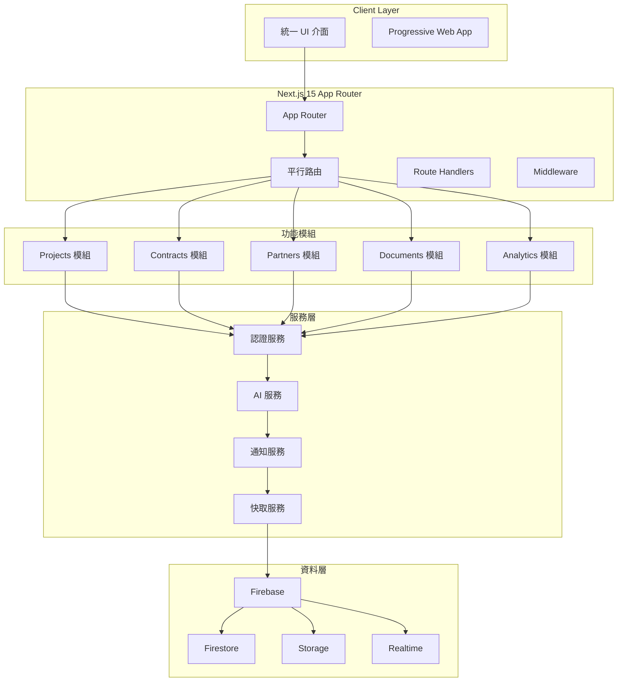
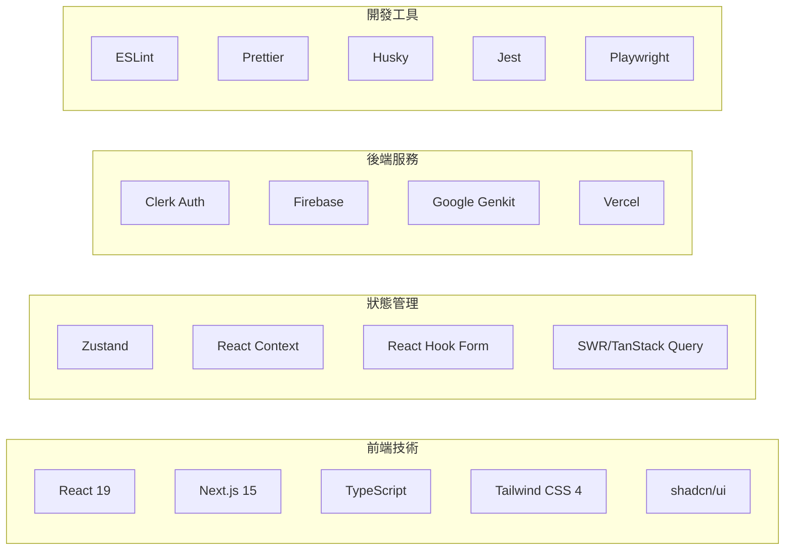
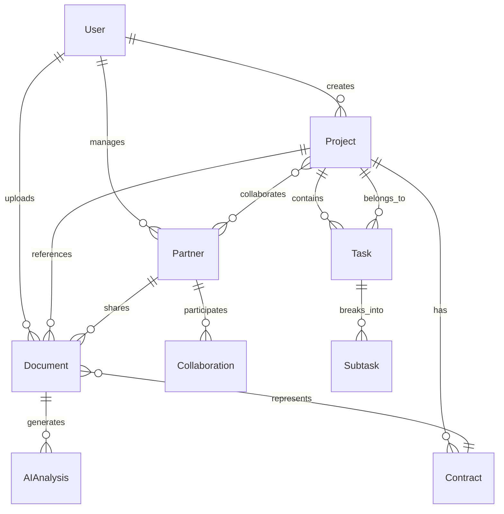
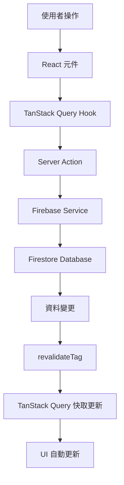
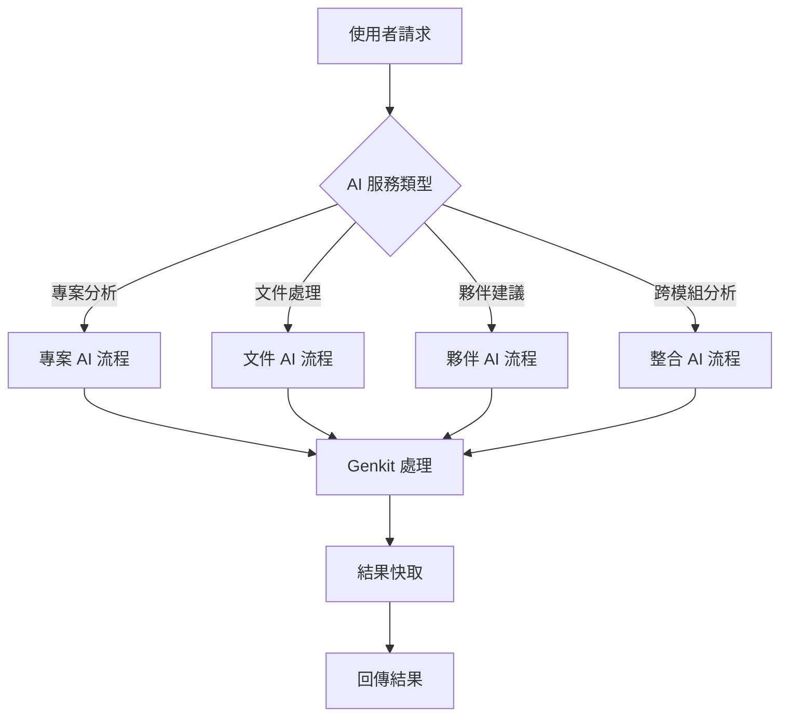
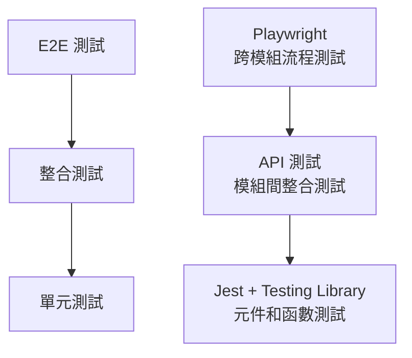

# 現代化技術架構指南

## 架構概覽

本專案採用 Next.js 15 的最新最佳實踐，結合現代化的技術棧，建立一個高效能、可維護的整合平台。

## 系統架構

### 整體架構圖



### 技術棧架構



## 核心技術決策

### 1. 捨棄 API Routes，擁抱 Server Actions

**為什麼選擇 Server Actions？**

根據 Next.js 15 官方文檔和最佳實踐，Server Actions 提供了以下優勢：

- **更好的類型安全**: Server Actions 與 TypeScript 深度整合
- **自動快取管理**: 內建 `revalidateTag` 和 `revalidatePath`
- **更簡潔的程式碼**: 減少樣板程式碼
- **更好的效能**: 直接在伺服器端執行，減少網路往返

```typescript
// ❌ 舊方式: API Routes
// app/api/projects/route.ts
export async function POST(request: Request) {
  const body = await request.json()
  // 處理邏輯...
  return Response.json(result)
}

// ✅ 新方式: Server Actions
// lib/actions/portfolio-actions.ts
'use server'

export async function createProject(formData: FormData) {
  const { userId } = auth()
  // 處理邏輯...
  revalidateTag('projects')
  return { success: true, data: result }
}
```

### 2. TanStack Query 作為狀態管理核心

**為什麼選擇 TanStack Query？**

- **伺服器狀態專家**: 專門處理伺服器狀態，比 SWR 功能更豐富
- **Firebase 整合**: `@tanstack-query-firebase` 提供完美的 Firebase 整合
- **樂觀更新**: 內建樂觀更新支援
- **強大的快取**: 智慧快取和背景重新整理

```typescript
// TanStack Query + Server Actions 的完美結合
export function useCreateProject() {
  const queryClient = useQueryClient()
  
  return useMutation({
    mutationFn: createProject, // Server Action
    onSuccess: (data) => {
      if (data.success) {
        // 自動更新相關查詢
        queryClient.invalidateQueries({ queryKey: ['projects'] })
      }
    },
  })
}
```

### 3. Firebase v9+ 模組化架構

**現代化的 Firebase 整合**:

```typescript
// lib/firebase/config.ts
import { initializeApp } from 'firebase/app'
import { getFirestore } from 'firebase/firestore'

export const app = initializeApp(firebaseConfig)
export const db = getFirestore(app)

// lib/services/firebase-service.ts
export class FirebaseService {
  async create<T>(collectionName: string, data: T) {
    const docRef = await addDoc(collection(db, collectionName), {
      ...data,
      createdAt: Timestamp.now(),
      updatedAt: Timestamp.now(),
    })
    return { id: docRef.id, ...data }
  }
}
```

## 資料架構設計

### 統一資料模型

```typescript
// 核心實體定義
interface BaseEntity {
  id: string
  createdAt: Timestamp
  updatedAt: Timestamp
  createdBy: string
  updatedBy: string
}

interface User extends BaseEntity {
  email: string
  name: string
  avatar?: string
  role: UserRole
  permissions: Permission[]
  preferences: UserPreferences
}

interface Project extends BaseEntity {
  title: string
  description: string
  status: ProjectStatus
  priority: Priority
  startDate: Date
  endDate?: Date
  progress: number
  tags: string[]
  // 關聯資料
  partnerId?: string
  documentIds: string[]
  taskIds: string[]
  contractIds: string[]
}

interface Partner extends BaseEntity {
  name: string
  type: PartnerType
  contactInfo: ContactInfo
  relationship: RelationshipType
  status: PartnerStatus
  // 關聯資料
  projectIds: string[]
  documentIds: string[]
  collaborationIds: string[]
}

interface Document extends BaseEntity {
  filename: string
  originalName: string
  mimeType: string
  size: number
  url: string
  // AI 處理結果
  extractedText?: string
  summary?: string
  keywords: string[]
  entities: ExtractedEntity[]
  // 關聯資料
  projectId?: string
  partnerId?: string
  contractId?: string
}
```

### 資料關係圖



## 資料流架構

### 1. 資料流向圖



### 2. 狀態管理層次

```typescript
// 1. 伺服器狀態 (TanStack Query)
const { data: projects } = useQuery({
  queryKey: ['projects', userId],
  queryFn: () => projectService.getProjects(userId),
})

// 2. 表單狀態 (React Hook Form)
const form = useForm({
  resolver: zodResolver(projectSchema),
})

// 3. 全域客戶端狀態 (Zustand)
const useUIStore = create((set) => ({
  sidebarOpen: true,
  toggleSidebar: () => set((state) => ({ sidebarOpen: !state.sidebarOpen })),
}))

// 4. 局部狀態 (React useState)
const [isModalOpen, setIsModalOpen] = useState(false)
```

## 認證與授權設計

### Clerk 整合架構

```typescript
// 認證配置
const clerkConfig = {
  publishableKey: process.env.NEXT_PUBLIC_CLERK_PUBLISHABLE_KEY,
  secretKey: process.env.CLERK_SECRET_KEY,
  signInUrl: '/sign-in',
  signUpUrl: '/sign-up',
  afterSignInUrl: '/dashboard',
  afterSignUpUrl: '/onboarding'
}

// 權限系統設計
interface Permission {
  resource: string // 'projects', 'partners', 'documents'
  action: string   // 'create', 'read', 'update', 'delete'
  scope: string    // 'own', 'team', 'all'
}

interface Role {
  name: string
  permissions: Permission[]
}

// 預定義角色
const roles: Record<string, Role> = {
  admin: {
    name: 'Administrator',
    permissions: [
      { resource: '*', action: '*', scope: 'all' }
    ]
  },
  manager: {
    name: 'Project Manager',
    permissions: [
      { resource: 'projects', action: '*', scope: 'team' },
      { resource: 'partners', action: 'read', scope: 'all' },
      { resource: 'documents', action: '*', scope: 'team' }
    ]
  },
  user: {
    name: 'Regular User',
    permissions: [
      { resource: 'projects', action: '*', scope: 'own' },
      { resource: 'partners', action: 'read', scope: 'all' },
      { resource: 'documents', action: '*', scope: 'own' }
    ]
  }
}
```

### 中間件設計

```typescript
// middleware.ts
export async function middleware(request: NextRequest) {
  const { auth } = getAuth(request)
  
  // 公開路由
  if (isPublicRoute(request.nextUrl.pathname)) {
    return NextResponse.next()
  }
  
  // 認證檢查
  if (!auth.userId) {
    return redirectToSignIn({ returnBackUrl: request.url })
  }
  
  // 權限檢查
  const hasPermission = await checkPermission(
    auth.userId,
    request.nextUrl.pathname,
    request.method
  )
  
  if (!hasPermission) {
    return NextResponse.json(
      { error: 'Forbidden' },
      { status: 403 }
    )
  }
  
  return NextResponse.next()
}
```

## 平行路由實作策略

### 1. 模組化設計

```typescript
// app/(dashboard)/layout.tsx
export default function DashboardLayout({
  children,
  projects,
  contracts,
  partners,
  documents,
  analytics
}: {
  children: React.ReactNode
  projects: React.ReactNode
  contracts: React.ReactNode
  partners: React.ReactNode
  documents: React.ReactNode
  analytics: React.ReactNode
}) {
  const { user } = useAuth()
  const permissions = usePermissions(user?.id)
  
  return (
    <div className="dashboard-layout">
      <Sidebar />
      <main className="main-content">
        {children}
        <ModuleContainer>
          {permissions.projects && (
            <ErrorBoundary fallback={<ModuleError module="Projects" />}>
              <Suspense fallback={<ModuleSkeleton />}>
                {projects}
              </Suspense>
            </ErrorBoundary>
          )}
          {permissions.contracts && (
            <ErrorBoundary fallback={<ModuleError module="Contracts" />}>
              <Suspense fallback={<ModuleSkeleton />}>
                {contracts}
              </Suspense>
            </ErrorBoundary>
          )}
          {permissions.partners && (
            <ErrorBoundary fallback={<ModuleError module="Partners" />}>
              <Suspense fallback={<ModuleSkeleton />}>
                {partners}
              </Suspense>
            </ErrorBoundary>
          )}
          {/* 其他模組... */}
        </ModuleContainer>
      </main>
    </div>
  )
}
```

### 2. 條件渲染和權限控制

```typescript
// lib/hooks/use-module-visibility.ts
export function useModuleVisibility(permissions: UserPermissions) {
  return useMemo(() => ({
    projects: permissions.includes('projects:read'),
    contracts: permissions.includes('contracts:read'),
    partners: permissions.includes('partners:read'),
    documents: permissions.includes('documents:read'),
    analytics: permissions.includes('analytics:read'),
  }), [permissions])
}
```

## AI 服務整合設計

### 統一 AI 服務架構

```typescript
// AI 服務抽象層
interface AIService {
  generateSubtasks(project: Project): Promise<Subtask[]>
  summarizeDocument(document: Document): Promise<DocumentSummary>
  suggestPartners(project: Project): Promise<Partner[]>
  generateInsights(data: CrossModuleData): Promise<Insights>
}

// Google Genkit 實作
class GenkitAIService implements AIService {
  private genkit: Genkit
  
  constructor() {
    this.genkit = configureGenkit({
      plugins: [googleAI()],
      logLevel: 'debug'
    })
  }
  
  async generateSubtasks(project: Project): Promise<Subtask[]> {
    const flow = defineFlow(
      {
        name: 'generateSubtasks',
        inputSchema: projectSchema,
        outputSchema: subtasksSchema
      },
      async (input) => {
        const prompt = `
          Based on the project: ${input.title}
          Description: ${input.description}
          Generate 5-10 specific subtasks that would help complete this project.
        `
        
        const response = await generate({
          model: gemini15Flash,
          prompt
        })
        
        return parseSubtasks(response.text())
      }
    )
    
    return await runFlow(flow, project)
  }
}
```

### AI 流程設計



## 狀態管理設計

### Zustand Store 架構

```typescript
// 全域狀態結構
interface AppState {
  // 認證狀態
  auth: AuthState
  // UI 狀態
  ui: UIState
  // 模組狀態
  projects: ProjectsState
  contracts: ContractsState
  partners: PartnersState
  documents: DocumentsState
  analytics: AnalyticsState
}

// 認證 Store
interface AuthState {
  user: User | null
  permissions: Permission[]
  isLoading: boolean
  error: string | null
}

interface AuthActions {
  setUser: (user: User) => void
  setPermissions: (permissions: Permission[]) => void
  logout: () => void
  checkPermission: (resource: string, action: string) => boolean
}

export const useAuthStore = create<AuthState & AuthActions>((set, get) => ({
  // 狀態
  user: null,
  permissions: [],
  isLoading: false,
  error: null,
  
  // 動作
  setUser: (user) => set({ user }),
  setPermissions: (permissions) => set({ permissions }),
  logout: () => set({ user: null, permissions: [] }),
  checkPermission: (resource, action) => {
    const { permissions } = get()
    return permissions.some(p => 
      (p.resource === resource || p.resource === '*') &&
      (p.action === action || p.action === '*')
    )
  }
}))
```

### 跨模組資料同步

```typescript
// 資料同步服務
class DataSyncService {
  private stores: Map<string, any> = new Map()
  
  registerStore(name: string, store: any) {
    this.stores.set(name, store)
  }
  
  async syncData(entityType: string, entityId: string, data: any) {
    // 更新相關的所有 stores
    for (const [name, store] of this.stores) {
      if (store.updateEntity) {
        await store.updateEntity(entityType, entityId, data)
      }
    }
    
    // 觸發相關的 UI 更新
    this.notifySubscribers(entityType, entityId, data)
  }
  
  private notifySubscribers(entityType: string, entityId: string, data: any) {
    // 實作訂閱者通知邏輯
  }
}
```

## 效能最佳化策略

### 1. Server Components 優先

```typescript
// ✅ Server Component (預設)
export default async function ProjectsPage() {
  // 在伺服器端獲取資料
  const projects = await projectService.getProjects()
  
  return (
    <div>
      <ProjectsList initialData={projects} />
    </div>
  )
}

// ✅ Client Component (僅在需要時)
'use client'

export function ProjectsList({ initialData }: { initialData: Project[] }) {
  const { data: projects } = useProjects({
    initialData,
  })
  
  return (
    <div>
      {projects.map(project => (
        <ProjectCard key={project.id} project={project} />
      ))}
    </div>
  )
}
```

### 2. 智慧程式碼分割

```typescript
// 動態載入大型模組
const AnalyticsModule = dynamic(() => import('@/features/analytics'), {
  loading: () => <ModuleSkeleton name="Analytics" />,
  ssr: false, // 僅客戶端載入
})

// 條件載入
export default function Dashboard({ activeModules }: DashboardProps) {
  return (
    <div>
      {activeModules.projects && <ProjectsModule />}
      {activeModules.contracts && <ContractsModule />}
      {activeModules.analytics && <AnalyticsModule />}
    </div>
  )
}
```

### 3. 快取策略

```typescript
// Next.js 15 快取策略
export async function getProjects(userId: string) {
  const projects = await fetch(`/api/projects?userId=${userId}`, {
    next: { 
      revalidate: 300, // 5 分鐘
      tags: ['projects', `user-${userId}`] 
    }
  })
  
  return projects.json()
}

// TanStack Query 快取
export function useProjects() {
  return useQuery({
    queryKey: ['projects'],
    queryFn: getProjects,
    staleTime: 5 * 60 * 1000, // 5 分鐘
    gcTime: 10 * 60 * 1000,   // 10 分鐘
  })
}
```

## 錯誤處理策略

### 1. 分層錯誤處理

```typescript
// 1. Server Action 錯誤處理
export async function createProject(formData: FormData) {
  try {
    const result = await projectService.create(data)
    return { success: true, data: result }
  } catch (error) {
    return { 
      success: false, 
      error: error instanceof Error ? error.message : 'Unknown error' 
    }
  }
}

// 2. TanStack Query 錯誤處理
export function useCreateProject() {
  return useMutation({
    mutationFn: createProject,
    onError: (error) => {
      toast.error('建立專案失敗: ' + error.message)
    },
  })
}

// 3. React 錯誤邊界
export function ModuleErrorBoundary({ children, moduleName }: Props) {
  return (
    <ErrorBoundary
      FallbackComponent={({ error, resetErrorBoundary }) => (
        <ModuleErrorFallback
          error={error}
          moduleName={moduleName}
          onRetry={resetErrorBoundary}
        />
      )}
    >
      {children}
    </ErrorBoundary>
  )
}
```

## 測試策略設計

### 測試金字塔



### 測試覆蓋率目標

- **單元測試**: > 80% 程式碼覆蓋率
- **整合測試**: > 70% API 端點覆蓋
- **E2E 測試**: 100% 關鍵使用者流程覆蓋

### 錯誤邊界架構

```typescript
// 全域錯誤邊界
class GlobalErrorBoundary extends Component<Props, State> {
  constructor(props: Props) {
    super(props)
    this.state = { hasError: false, error: null }
  }
  
  static getDerivedStateFromError(error: Error): State {
    return { hasError: true, error }
  }
  
  componentDidCatch(error: Error, errorInfo: ErrorInfo) {
    // 記錄錯誤到監控服務
    errorReportingService.captureException(error, {
      extra: errorInfo,
      tags: { component: 'GlobalErrorBoundary' }
    })
  }
  
  render() {
    if (this.state.hasError) {
      return <ErrorFallback error={this.state.error} />
    }
    
    return this.props.children
  }
}

// 模組級錯誤邊界
const ModuleErrorBoundary = ({ children, moduleName }: Props) => {
  return (
    <ErrorBoundary
      FallbackComponent={({ error, resetErrorBoundary }) => (
        <ModuleErrorFallback
          error={error}
          moduleName={moduleName}
          onRetry={resetErrorBoundary}
        />
      )}
      onError={(error, errorInfo) => {
        errorReportingService.captureException(error, {
          tags: { module: moduleName },
          extra: errorInfo
        })
      }}
    >
      {children}
    </ErrorBoundary>
  )
}
```

## 開發工作流程

### 1. 功能開發流程

1. **定義 Server Action**
   ```typescript
   // lib/actions/projects-actions.ts 或 contracts-actions.ts
   'use server'
   export async function createProject(formData: FormData) { ... }
   export async function createContract(formData: FormData) { ... }
   ```

2. **建立 TanStack Query Hook**
   ```typescript
   // lib/queries/projects-queries.ts 或 contracts-queries.ts
   export function useCreateProject() { ... }
   export function useCreateContract() { ... }
   ```

3. **實作 UI 元件**
   ```typescript
   // components/projects/project-form.tsx 或 components/contracts/contract-form.tsx
   export function ProjectForm() {
     const createProject = useCreateProject()
     // ...
   }
   ```

4. **整合到平行路由**
   ```typescript
   // app/(dashboard)/@projects/page.tsx 或 app/(dashboard)/@contracts/page.tsx
   export default function ProjectsPage() { ... }
   export default function ContractsPage() { ... }
   ```

### 2. 測試策略

```typescript
// 測試 Server Actions
describe('createProject', () => {
  it('should create project successfully', async () => {
    const formData = new FormData()
    formData.append('title', 'Test Project')
    
    const result = await createProject(formData)
    expect(result.success).toBe(true)
  })
})

// 測試 TanStack Query Hooks
describe('useCreateProject', () => {
  it('should handle mutation correctly', async () => {
    const { result } = renderHook(() => useCreateProject(), {
      wrapper: QueryClientProvider,
    })
    
    await act(async () => {
      result.current.mutate(mockFormData)
    })
    
    expect(result.current.isSuccess).toBe(true)
  })
})
```

## 進階 Next.js 15 特性

### 攔截路由 (Intercepting Routes)

#### 路由攔截約定
- `(.)folder`: 攔截同級路由
- `(..)folder`: 攔截上一級路由
- `(..)(..)folder`: 攔截上兩級路由
- `(...)folder`: 攔截根目錄路由

#### 模態框實作範例
```
app/
├── @modal/
│   ├── (.)photo/
│   │   └── [id]/
│   │       └── page.tsx  # 攔截 /photo/[id]
│   └── default.tsx
├── photo/
│   └── [id]/
│       └── page.tsx      # 原始路由
└── layout.tsx
```

```typescript
// app/layout.tsx
export default function Layout({
  children,
  modal
}: {
  children: React.ReactNode
  modal: React.ReactNode
}) {
  return (
    <>
      {children}
      {modal}
    </>
  )
}

// app/@modal/(.)photo/[id]/page.tsx
export default function PhotoModal({ params }: { params: { id: string } }) {
  return (
    <Modal>
      <PhotoDetail id={params.id} />
    </Modal>
  )
}
```

### 國際化 (i18n)

#### 基本設定
```typescript
// next.config.js
module.exports = {
  i18n: {
    locales: ['en', 'zh-TW', 'ja'],
    defaultLocale: 'en',
  },
}

// app/[lang]/layout.tsx
export async function generateStaticParams() {
  return [{ lang: 'en' }, { lang: 'zh-TW' }, { lang: 'ja' }]
}

export default async function Layout({
  children,
  params
}: {
  children: React.ReactNode
  params: { lang: string }
}) {
  return (
    <html lang={params.lang}>
      <body>{children}</body>
    </html>
  )
}
```

### 元資料管理

#### 靜態元資料
```typescript
// app/page.tsx
import type { Metadata } from 'next'

export const metadata: Metadata = {
  title: 'My App',
  description: 'This is my awesome app',
  keywords: ['nextjs', 'react', 'typescript'],
  authors: [{ name: 'John Doe' }],
  openGraph: {
    title: 'My App',
    description: 'This is my awesome app',
    images: ['/og-image.jpg'],
  },
}

export default function Page() {
  return <div>Home Page</div>
}
```

#### 動態元資料
```typescript
// app/blog/[slug]/page.tsx
export async function generateMetadata({
  params
}: {
  params: { slug: string }
}): Promise<Metadata> {
  const post = await getPost(params.slug)
  
  return {
    title: post.title,
    description: post.excerpt,
    openGraph: {
      title: post.title,
      description: post.excerpt,
      images: [post.image],
    },
  }
}
```

## 部署考量

### 1. 環境配置

```typescript
// next.config.ts
const nextConfig = {
  experimental: {
    serverActions: {
      allowedOrigins: ['localhost:3000', 'your-domain.com'],
    },
  },
  // 其他配置...
}
```

### 2. 效能監控

```typescript
// lib/monitoring.ts
export function trackServerAction(actionName: string, duration: number) {
  // 監控 Server Actions 效能
  analytics.track('server_action', {
    action: actionName,
    duration,
    timestamp: Date.now(),
  })
}
```

這個現代化架構確保了：
- **最佳效能**: 充分利用 Next.js 15 的最新特性
- **開發體驗**: 類型安全和優秀的 DX
- **可維護性**: 清晰的架構和關注點分離
- **可擴展性**: 模組化設計易於擴展
- **使用者體驗**: 快速載入和流暢互動