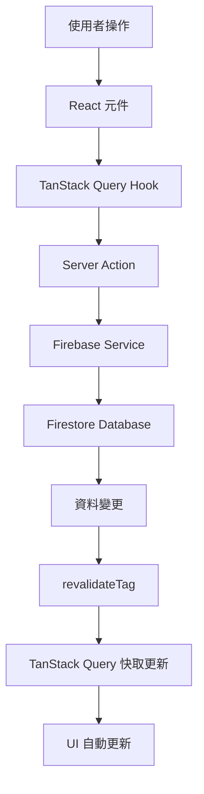

# 現代化技術架構指南

## 架構概覽

本專案採用 Next.js 15 的最新最佳實踐，結合現代化的技術棧，建立一個高效能、可維護的整合平台。

## 核心技術決策

### 1. 捨棄 API Routes，擁抱 Server Actions

**為什麼選擇 Server Actions？**

根據 Next.js 15 官方文檔和最佳實踐，Server Actions 提供了以下優勢：

- **更好的類型安全**: Server Actions 與 TypeScript 深度整合
- **自動快取管理**: 內建 `revalidateTag` 和 `revalidatePath`
- **更簡潔的程式碼**: 減少樣板程式碼
- **更好的效能**: 直接在伺服器端執行，減少網路往返

```typescript
// ❌ 舊方式: API Routes
// app/api/projects/route.ts
export async function POST(request: Request) {
  const body = await request.json()
  // 處理邏輯...
  return Response.json(result)
}

// ✅ 新方式: Server Actions
// lib/actions/portfolio-actions.ts
'use server'

export async function createProject(formData: FormData) {
  const { userId } = auth()
  // 處理邏輯...
  revalidateTag('projects')
  return { success: true, data: result }
}
```

### 2. TanStack Query 作為狀態管理核心

**為什麼選擇 TanStack Query？**

- **伺服器狀態專家**: 專門處理伺服器狀態，比 SWR 功能更豐富
- **Firebase 整合**: `@tanstack-query-firebase` 提供完美的 Firebase 整合
- **樂觀更新**: 內建樂觀更新支援
- **強大的快取**: 智慧快取和背景重新整理

```typescript
// TanStack Query + Server Actions 的完美結合
export function useCreateProject() {
  const queryClient = useQueryClient()
  
  return useMutation({
    mutationFn: createProject, // Server Action
    onSuccess: (data) => {
      if (data.success) {
        // 自動更新相關查詢
        queryClient.invalidateQueries({ queryKey: ['projects'] })
      }
    },
  })
}
```

### 3. Firebase v9+ 模組化架構

**現代化的 Firebase 整合**:

```typescript
// lib/firebase/config.ts
import { initializeApp } from 'firebase/app'
import { getFirestore } from 'firebase/firestore'

export const app = initializeApp(firebaseConfig)
export const db = getFirestore(app)

// lib/services/firebase-service.ts
export class FirebaseService {
  async create<T>(collectionName: string, data: T) {
    const docRef = await addDoc(collection(db, collectionName), {
      ...data,
      createdAt: Timestamp.now(),
      updatedAt: Timestamp.now(),
    })
    return { id: docRef.id, ...data }
  }
}
```

## 資料流架構

### 1. 資料流向圖



### 2. 狀態管理層次

```typescript
// 1. 伺服器狀態 (TanStack Query)
const { data: projects } = useQuery({
  queryKey: ['projects', userId],
  queryFn: () => projectService.getProjects(userId),
})

// 2. 表單狀態 (React Hook Form)
const form = useForm({
  resolver: zodResolver(projectSchema),
})

// 3. 全域客戶端狀態 (Zustand)
const useUIStore = create((set) => ({
  sidebarOpen: true,
  toggleSidebar: () => set((state) => ({ sidebarOpen: !state.sidebarOpen })),
}))

// 4. 局部狀態 (React useState)
const [isModalOpen, setIsModalOpen] = useState(false)
```

## 平行路由實作策略

### 1. 模組化設計

```typescript
// app/(dashboard)/layout.tsx
export default function DashboardLayout({
  children,
  portfolio,
  partners,
  documents,
  analytics
}: {
  children: React.ReactNode
  portfolio: React.ReactNode
  partners: React.ReactNode
  documents: React.ReactNode
  analytics: React.ReactNode
}) {
  const { user } = useAuth()
  const permissions = usePermissions(user?.id)
  
  return (
    <div className="dashboard-layout">
      <Sidebar />
      <main className="main-content">
        {children}
        <ModuleContainer>
          {permissions.portfolio && (
            <ErrorBoundary fallback={<ModuleError module="Portfolio" />}>
              <Suspense fallback={<ModuleSkeleton />}>
                {portfolio}
              </Suspense>
            </ErrorBoundary>
          )}
          {permissions.partners && (
            <ErrorBoundary fallback={<ModuleError module="Partners" />}>
              <Suspense fallback={<ModuleSkeleton />}>
                {partners}
              </Suspense>
            </ErrorBoundary>
          )}
          {/* 其他模組... */}
        </ModuleContainer>
      </main>
    </div>
  )
}
```

### 2. 條件渲染和權限控制

```typescript
// lib/hooks/use-module-visibility.ts
export function useModuleVisibility(permissions: UserPermissions) {
  return useMemo(() => ({
    portfolio: permissions.includes('portfolio:read'),
    partners: permissions.includes('partners:read'),
    documents: permissions.includes('documents:read'),
    analytics: permissions.includes('analytics:read'),
  }), [permissions])
}
```

## 效能最佳化策略

### 1. Server Components 優先

```typescript
// ✅ Server Component (預設)
export default async function ProjectsPage() {
  // 在伺服器端獲取資料
  const projects = await projectService.getProjects()
  
  return (
    <div>
      <ProjectsList initialData={projects} />
    </div>
  )
}

// ✅ Client Component (僅在需要時)
'use client'

export function ProjectsList({ initialData }: { initialData: Project[] }) {
  const { data: projects } = useProjects({
    initialData,
  })
  
  return (
    <div>
      {projects.map(project => (
        <ProjectCard key={project.id} project={project} />
      ))}
    </div>
  )
}
```

### 2. 智慧程式碼分割

```typescript
// 動態載入大型模組
const AnalyticsModule = dynamic(() => import('@/features/analytics'), {
  loading: () => <ModuleSkeleton name="Analytics" />,
  ssr: false, // 僅客戶端載入
})

// 條件載入
export default function Dashboard({ activeModules }: DashboardProps) {
  return (
    <div>
      {activeModules.analytics && <AnalyticsModule />}
    </div>
  )
}
```

### 3. 快取策略

```typescript
// Next.js 15 快取策略
export async function getProjects(userId: string) {
  const projects = await fetch(`/api/projects?userId=${userId}`, {
    next: { 
      revalidate: 300, // 5 分鐘
      tags: ['projects', `user-${userId}`] 
    }
  })
  
  return projects.json()
}

// TanStack Query 快取
export function useProjects() {
  return useQuery({
    queryKey: ['projects'],
    queryFn: getProjects,
    staleTime: 5 * 60 * 1000, // 5 分鐘
    gcTime: 10 * 60 * 1000,   // 10 分鐘
  })
}
```

## 錯誤處理策略

### 1. 分層錯誤處理

```typescript
// 1. Server Action 錯誤處理
export async function createProject(formData: FormData) {
  try {
    const result = await projectService.create(data)
    return { success: true, data: result }
  } catch (error) {
    return { 
      success: false, 
      error: error instanceof Error ? error.message : 'Unknown error' 
    }
  }
}

// 2. TanStack Query 錯誤處理
export function useCreateProject() {
  return useMutation({
    mutationFn: createProject,
    onError: (error) => {
      toast.error('建立專案失敗: ' + error.message)
    },
  })
}

// 3. React 錯誤邊界
export function ModuleErrorBoundary({ children, moduleName }: Props) {
  return (
    <ErrorBoundary
      FallbackComponent={({ error, resetErrorBoundary }) => (
        <ModuleErrorFallback
          error={error}
          moduleName={moduleName}
          onRetry={resetErrorBoundary}
        />
      )}
    >
      {children}
    </ErrorBoundary>
  )
}
```

## 開發工作流程

### 1. 功能開發流程

1. **定義 Server Action**
   ```typescript
   // lib/actions/feature-actions.ts
   'use server'
   export async function createFeature(formData: FormData) { ... }
   ```

2. **建立 TanStack Query Hook**
   ```typescript
   // lib/queries/feature-queries.ts
   export function useCreateFeature() { ... }
   ```

3. **實作 UI 元件**
   ```typescript
   // components/feature/feature-form.tsx
   export function FeatureForm() {
     const createFeature = useCreateFeature()
     // ...
   }
   ```

4. **整合到平行路由**
   ```typescript
   // app/(dashboard)/@feature/page.tsx
   export default function FeaturePage() { ... }
   ```

### 2. 測試策略

```typescript
// 測試 Server Actions
describe('createProject', () => {
  it('should create project successfully', async () => {
    const formData = new FormData()
    formData.append('title', 'Test Project')
    
    const result = await createProject(formData)
    expect(result.success).toBe(true)
  })
})

// 測試 TanStack Query Hooks
describe('useCreateProject', () => {
  it('should handle mutation correctly', async () => {
    const { result } = renderHook(() => useCreateProject(), {
      wrapper: QueryClientProvider,
    })
    
    await act(async () => {
      result.current.mutate(mockFormData)
    })
    
    expect(result.current.isSuccess).toBe(true)
  })
})
```

## 部署考量

### 1. 環境配置

```typescript
// next.config.ts
const nextConfig = {
  experimental: {
    serverActions: {
      allowedOrigins: ['localhost:3000', 'your-domain.com'],
    },
  },
  // 其他配置...
}
```

### 2. 效能監控

```typescript
// lib/monitoring.ts
export function trackServerAction(actionName: string, duration: number) {
  // 監控 Server Actions 效能
  analytics.track('server_action', {
    action: actionName,
    duration,
    timestamp: Date.now(),
  })
}
```

這個現代化架構確保了：
- **最佳效能**: 充分利用 Next.js 15 的最新特性
- **開發體驗**: 類型安全和優秀的 DX
- **可維護性**: 清晰的架構和關注點分離
- **可擴展性**: 模組化設計易於擴展
- **使用者體驗**: 快速載入和流暢互動